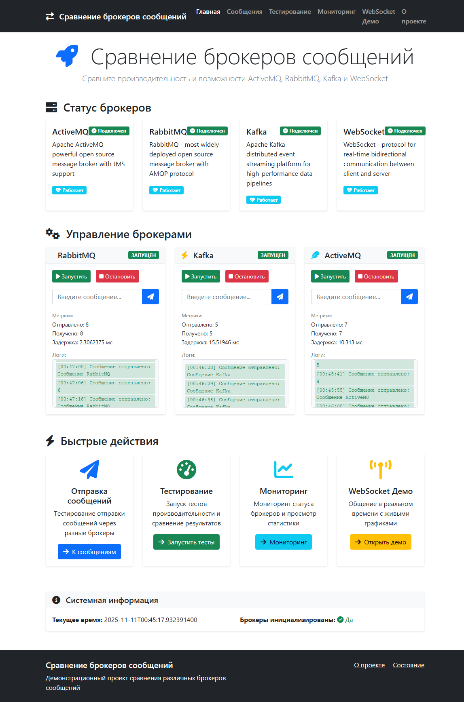
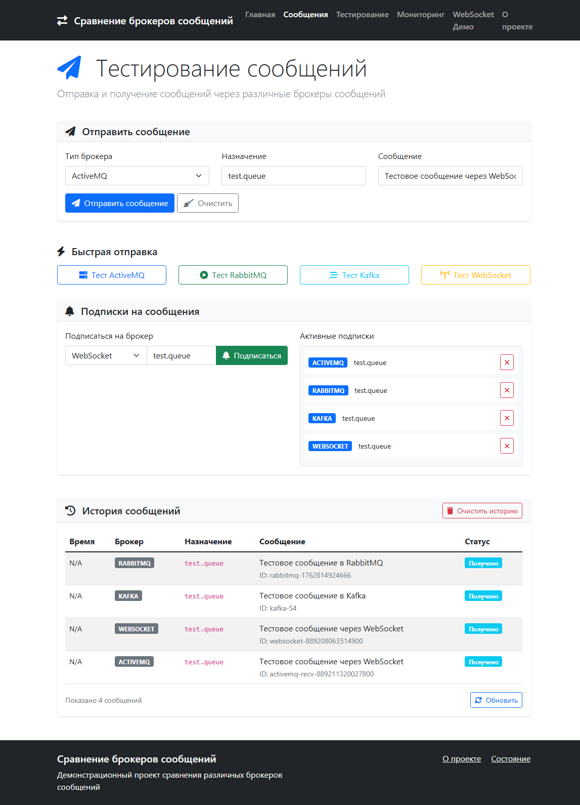
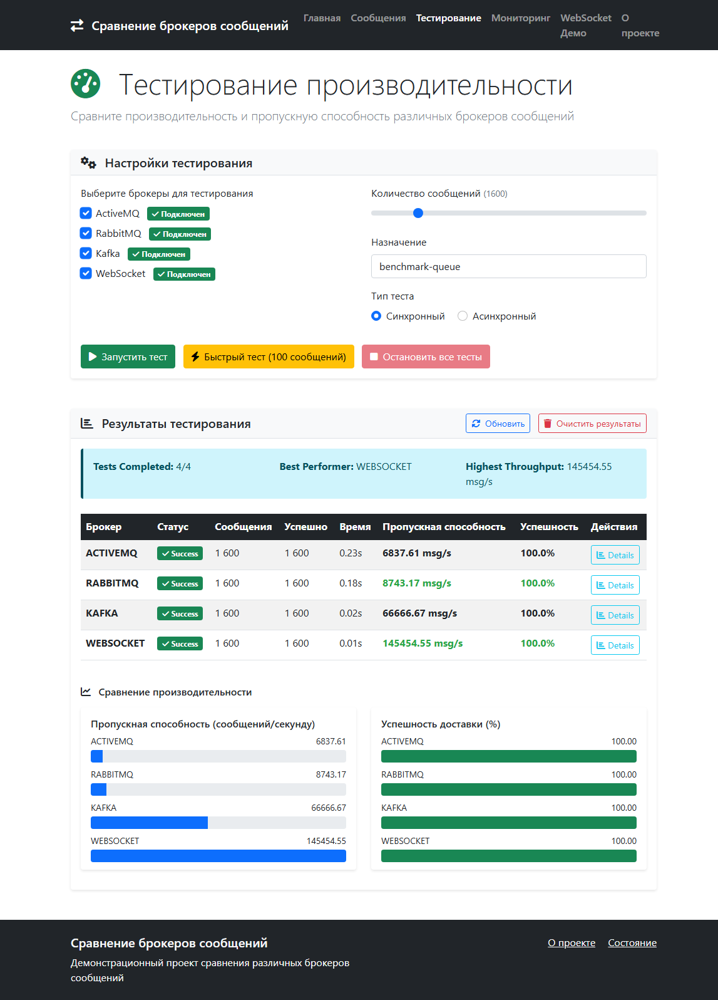
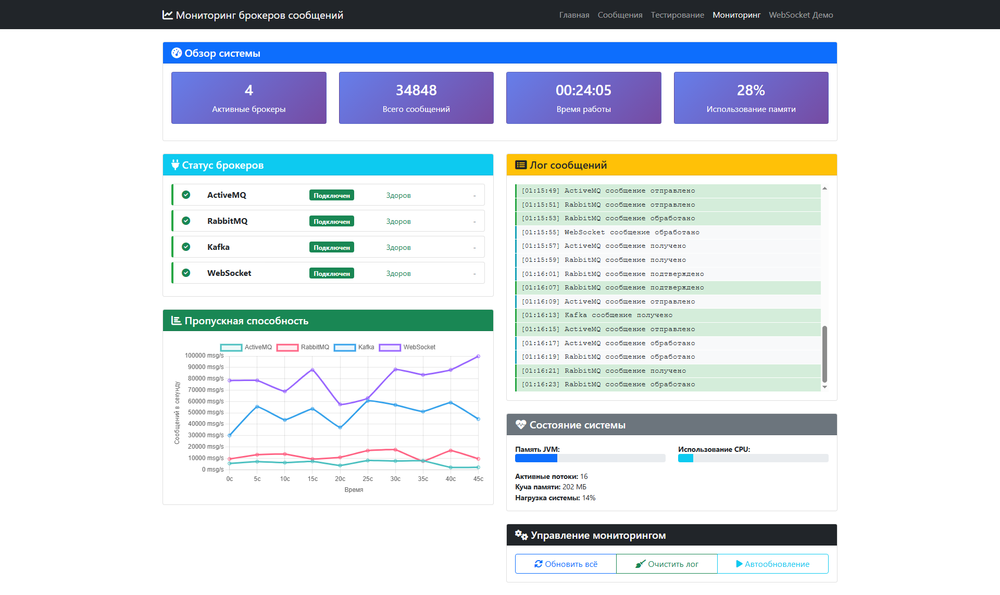
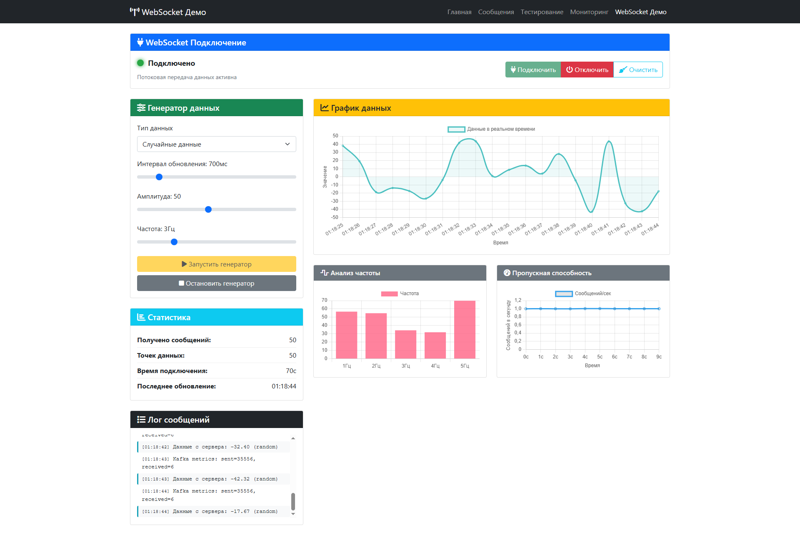

# 🚀 Сравнение брокеров сообщений (Message Brokers Comparison)


**Enterprise-grade платформа для сравнительного анализа производительности брокеров сообщений.** Поддержка ActiveMQ, RabbitMQ, Kafka и WebSocket с унифицированным API и real-time мониторингом.

## 📊 Демо

<div align="center">

### 🏠 Главная страница


### 📨 Тестирование сообщений


### ⚡ Benchmark тесты


### 📈 Real-time мониторинг


### 🔄 WebSocket демо


</div>

## 🎯 Возможности

### 🔌 Мульти-брокерная поддержка
- **ActiveMQ** - JMS-based корпоративный брокер
- **RabbitMQ** - AMQP с продвинутой маршрутизацией
- **Kafka** - Высокопроизводительная streaming-платформа
- **WebSocket** - Real-time веб-коммуникация

### 📊 Производительность и анализ
- ✅ **Benchmark тестирование** - Сравнение throughput и latency
- 📈 **Real-time метрики** - Мониторинг в реальном времени
- 📉 **Интерактивные графики** - Визуализация результатов
- ⚡ **Load testing** - Тестирование под нагрузкой

### 🛠 Enterprise-функции
- 🔧 **Унифицированный API** - Единый интерфейс для всех брокеров
- 🏗 **Модульная архитектура** - Легкое добавление новых брокеров
- 🚀 **Production-ready** - Health checks, мониторинг, логирование
- 🔒 **Надежность** - Graceful degradation, retry механизмы

## 🏗 Архитектура

### Модульная структура

```
message-brokers-comparison/
├── 📁 broker-core/           # Основные интерфейсы и абстракции
├── 📁 shared-dto/            # Общие DTO для всех модулей
├── 📁 activemq-module/       # Реализация ActiveMQ брокера
├── 📁 rabbitmq-module/       # Реализация RabbitMQ брокера  
├── 📁 kafka-module/          # Реализация Kafka брокера
├── 📁 websocket-module/      # Реализация WebSocket брокера
├── 📁 demo-app/              # Основное Spring Boot приложение
└── 📁 infrastructure/        # Docker конфигурации
```

### Принципы проектирования и паттерны

#### 🎯 Архитектурные паттерны
- **Layered Architecture** - Четкое разделение на Presentation, Business, Integration слои
- **Microservices-ready** - Модульная структура для легкого масштабирования
- **Hexagonal Architecture** - Ядро системы изолировано от внешних зависимостей

#### 🔧 Паттерны проектирования
- **Factory Pattern** - `MessageBrokerFactory` для создания экземпляров брокеров
- **Strategy Pattern** - Интерфейс `MessageBroker` для interchangeable реализаций
- **Observer Pattern** - `MessageListener` для обработки входящих сообщений
- **Decorator Pattern** - Добавление метрик и логирования без изменения основной логики
- **Builder Pattern** - Постепенное создание сложных DTO объектов
- **Singleton Pattern** - Spring бины для управления состоянием соединений

#### 📐 Принципы SOLID
- **Single Responsibility** - Каждый класс имеет одну причину для изменений
- **Open/Closed** - Легкое добавление новых брокеров без изменения существующего кода
- **Liskov Substitution** - Все брокеры взаимозаменяемы через общий интерфейс
- **Interface Segregation** - Специализированные интерфейсы для разных аспектов функциональности
- **Dependency Inversion** - Зависимости направлены к абстракциям, а не реализациям

### 🛠 Технологический стек
| Слой | Технологии                                 |
|------|--------------------------------------------|
| **Backend** | Java 19, Spring Boot 3.5.7, Maven          |
| **Брокеры** | ActiveMQ, RabbitMQ, Kafka, WebSocket       |
| **Frontend** | Thymeleaf, Bootstrap 5, Chart.js, JavaScript     |
| **Инфраструктура** | Docker, Docker Compose     |
| **Мониторинг** | Spring Actuator, Micrometer, Health Checks |


## 🚀 Быстрый старт

### Предварительные требования
- Java 19+
- Maven 3.8+
- Docker & Docker Compose

### 1. Клонирование репозитория

```bash
git clone https://github.com/vyanckus/message-brokers-comparison.git
cd message-brokers-comparison
```
### 2\. Запуск инфраструктуры

```bash
cd infrastructure
docker-compose up -d
```

Проверьте доступность брокеров:

*   🔗 ActiveMQ Console: [http://localhost:8161](http://localhost:8161/) (admin/admin)

*   🐇 RabbitMQ Console: [http://localhost:15672](http://localhost:15672/) (guest/guest)

*   ⚡ Kafka: [http://localhost:9092](http://localhost:9092/)


### 3\. Сборка и запуск приложения

```bash
# Сборка всех модулей
mvn clean install

# Запуск приложения
cd demo-app
mvn spring-boot:run
```

### 4\. Открытие приложения

Откройте в браузере: [http://localhost:8080](http://localhost:8080/)


## 📖 Использование

### 🏠 Главная страница

*   Обзор статуса всех брокеров

*   Быстрое управление подключениями

*   Доступ к основным функциям


### 📨 Тестирование сообщений

*   Отправка сообщений через разные брокеры

*   Подписка на получение сообщений

*   Просмотр истории сообщений


### ⚡ Benchmark тесты

*   Сравнение производительности брокеров

*   Настройка параметров тестирования

*   Графики результатов в реальном времени


### 📈 Мониторинг

*   Статус брокеров и системные метрики

*   Live-обновление данных

*   Детальная диагностика


### 🔄 WebSocket демо

*   Интерактивные графики с живыми данными

*   Генератор тестовых данных

*   Real-time статистика


## 🔧 API Endpoints

### Управление сообщениями

```http
POST   /api/messages/initialize                   # Инициализация всех брокеров
POST   /api/messages/send                         # Отправка сообщения
POST   /api/messages/subscribe/{brokerType}       # Подписка на сообщения
POST   /api/messages/{brokerType}/start           # Запуск конкретного брокера
POST   /api/messages/{brokerType}/stop            # Остановка конкретного брокера
POST   /api/messages/{brokerType}/send            # Отправка через конкретный брокер
GET    /api/messages/status                       # Статус всех брокеров
GET    /api/messages/history                      # История сообщений
GET    /api/messages/metrics                      # Детальные метрики брокеров
DELETE /api/messages/history                      # Очистка истории сообщений
```

### Benchmark тесты

```http
POST   /api/benchmark/run                         # Синхронный benchmark тест
POST   /api/benchmark/start-async                 # Асинхронный benchmark тест
POST   /api/benchmark/stop/{benchmarkId}          # Остановка конкретного теста
POST   /api/benchmark/stop-all                    # Остановка всех тестов
GET    /api/benchmark/status                      # Статус активных тестов
GET    /api/benchmark/info                        # Информация о сервисе
```

### Мониторинг и метрики

```http
GET    /api/metrics/brokers                      # Метрики производительности брокеров
GET    /api/metrics/system                       # Системные метрики JVM
GET    /actuator/health                          # Health checks (Spring Actuator)
GET    /actuator/metrics                         # Все метрики приложения
GET    /actuator/info                            # Информация о приложении
```

### WebSocket Endpoints

```http
WS     /ws                                      # WebSocket endpoint
POST   /app/websocket/control                   # Управление генератором данных
POST   /app/websocket/chart                     # Запрос данных для графиков
POST   /app/websocket/status                    # Проверка статуса генератора
POST   /app/chat                                # Чат сообщения
POST   /app/livedata                            # Real-time данные
POST   /app/broker-data                         # Данные для интеграции с брокерами
SUB    /topic/livedata                          # Подписка на реальные данные
SUB    /topic/chartdata                         # Подписка на данные графиков
SUB    /topic/generator-status                  # Статус генератора
SUB    /topic/chat                              # Чат сообщения
SUB    /topic/performance                       # Данные производительности
SUB    /topic/statistics                        # Статистика брокеров
```


## 📚 Документация

### Генерация Javadoc

Проект содержит полную Javadoc документацию для всех основных компонентов:


```bash
# Генерация документации для всего проекта
mvn javadoc:aggregate

# Документация будет доступна по пути:
# target/site/apidocs/index.html
```

### Структура документации

*   Модуль shared-dto \- Data Transfer Objects для взаимодействия между модулями

*   Модуль broker-core \- Ядро системы с интерфейсами брокеров и фабриками

*   Модуль demo-app \- Spring Boot приложение с REST API и Web интерфейсом

*   Модули брокеров \- Реализации для ActiveMQ, RabbitMQ, Kafka и WebSocket


### Особенности документации

*   Полное описание всех классов, методов и их параметров

*   Примеры использования API

*   Диаграммы взаимодействия компонентов

*   Описание архитектурных решений и паттернов


## 🐛 Troubleshooting

### Проблемы с подключением к брокерам


```bash
# Проверка статуса контейнеров
docker ps

# Просмотр логов
docker logs activemq
docker logs rabbitmq
docker logs kafka
```

### Проблемы с WebSocket

*   Убедитесь, что браузер поддерживает WebSocket

*   Проверьте консоль браузера (F12) на наличие ошибок

*   Проверьте настройки CORS


### Проблемы со сборкой


```bash
# Очистка проекта
mvn clean

# Обновление зависимостей
mvn dependency:resolve

# Проверка версии Java
java -version
```

## 📄 Лицензия

Этот проект распространяется под лицензией MIT. Подробнее см. в файле [LICENSE](LICENSE).


## 👨‍💻 Автор

Фёдор Вянцкус

*   GitHub: [@vyanckus](https://github.com/vyanckus)

*   Email: vyanckus@mail.ru


### ⭐ Если этот проект был полезен, поставьте звезду на GitHub!
